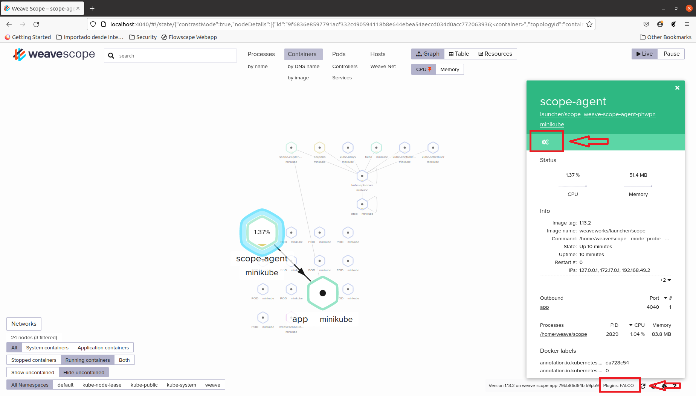
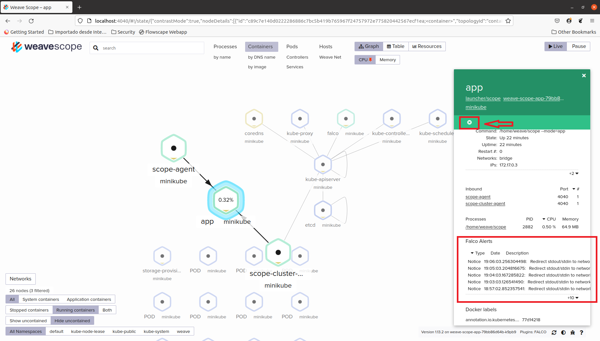

# scope-falco
Weaveworks Plugin for Falco Agent

The Scope Falco Agent plugin is a python application that retrieves alerts from a Falco Agent and show them in the corresponding container in the [Weave Scope](https://github.com/weaveworks/scope) UI.



## How to Run Scope Falco Plugin

The Scope Falco plugin can be executed stand alone.
It will respond to `GET /report` request on the `/var/run/scope/plugins/falco-scope/falco-scope.sock` in a JSON format.
If the running plugin has been registered by Scope, you will see it in the list of `PLUGINS` in the bottom right of the UI (see the red rectangle in the above figure).
The measured value is shown in the *STATUS* section (see the circle in the above figure).

### Using a pre-built Docker image


To run the Scope Falco plugin you just need to run the following command.

```
docker run --rm -ti \
	--net=host \
	-v /var/run/scope/plugins:/var/run/scope/plugins \
	--name weaveworksplugins-scope-falco weaveworksplugins/scope-falco:latest
```

### Kubernetes deployment

First, you need to run Falco Agent following instructions from www.falco.org:
```
helm install falco falcosecurity/falco
```

You also need to build docker image locally:
```
docker build . -t weaveworksplugins/scope-falco
```

Once Falco Pod is running,  deploy Scope Falco plugin in an already set up Kubernetes cluster with Weave Scope running on it:

```
kubectl apply -f https://github.com/adjperez/scope-falco/main/deployments/k8s-falco.yaml
```

Make sure that all Pods are in Runnin status:

```
kubectl get pods -A | grep falco
kubectl get pods -A | grep weave
```

### Recompiling an image

```
git clone git@github.com:adjperez/scope-falco.git

cd scope-falco; make;
```

## How to use Scope Falco Plugin

Scope Falco adds a new icon (see red square) to enable Falco Alerts in every container:


If that button is selected, alerts will be visible in the container. Another button (see red square) will also visible to disable these alerts:




## Getting Help

Please send an email to adjperez@gmail.com
